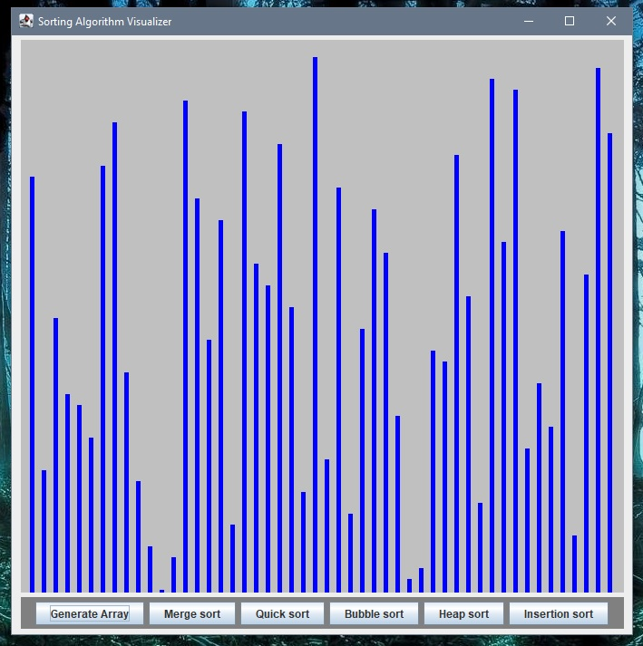

# Java-Sorting-Algo-Visualizer

clone of my python-sortAlgo Visualizer: https://github.com/RomanJ55/SortingAlgoVisualizer

My first Java Project
 - learning Java by re-building my python project
 - using Swing for the GUI
 - using Threading for the visualisations in real time
 - may not be optimal coded(and messy) since I'm still exploring Java and its libralies

Currently supporting:
 - bubble sort

Todo:
- Use objects with values+colors for better visualisation(using int[] atm)

- Implement other algorithms
  - merge sort
  - heap sort
  - quick sort
  - insertion sort
 
 
 
 

