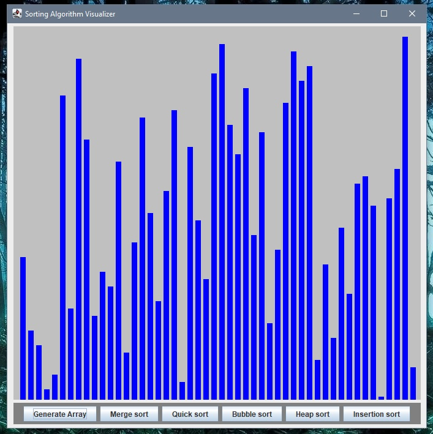
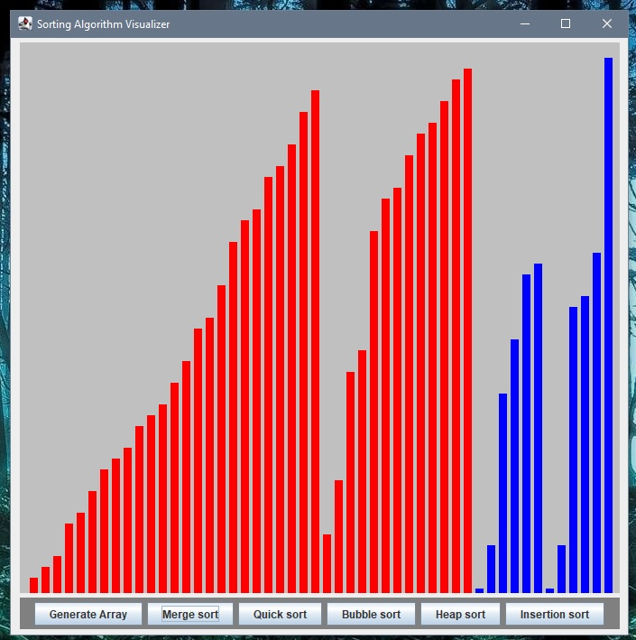

# Java-Sorting-Algo-Visualizer

clone of my python-sortAlgo Visualizer: https://github.com/RomanJ55/SortingAlgoVisualizer

My first Java Project
 - learning Java by re-building my python project
 - using Swing for the GUI
 - exploring Interfaces and Enums
 - using Threading for the visualisations

Program supports:
 - Soring Algorithms:
   - bubble sort
   - merge sort
   - heap sort
   - quick sort
   - insertion sort
 - visualisation in real time

 
 
 
 
 

